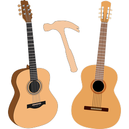
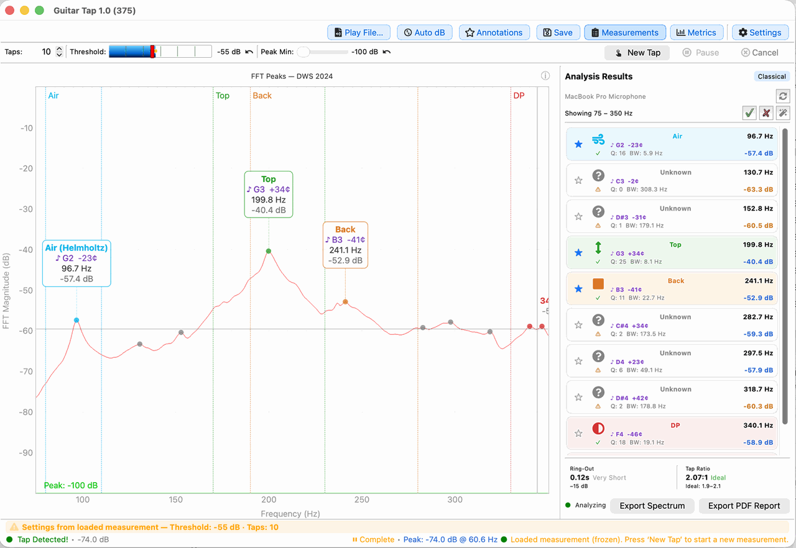

  

<h1 align="center">Guitar Tap</h1>

  <b>Tap-tone analysis for luthiers — capture a tap, run an FFT, and reveal a guitar's resonant modes and a tonewood's stiffness.</b>

  <a href="https://github.com/dwsdolce/guitar_tap/releases">Download</a> ·
  <a href="https://www.dolcesfogato.com/guitar_tap/">Website</a> ·
  <a href="https://www.dolcesfogato.com/guitar_tap/manual/">User Manual</a>

---

Guitar Tap captures the brief ring-out after you tap a guitar, a tonewood plate, or a
brace, runs a high-resolution FFT, and reveals the resonant peaks and material properties
that matter to guitar builders. Use the results to guide your bracing, mass distribution,
and plate thickness.

It implements the tap-tone methodology from *Contemporary Acoustic Guitar Design and Build*
by Trevor Gore in collaboration with Gerard Gilet — built to improve reproducibility in
guitar building.

Guitar Tap is **free and open source**, written in Python 3 with PySide6, and runs on
Windows, macOS, and Linux. A polished native edition for iPhone, iPad, and Mac is also
coming to the App Store.

## Features

- **Guitar mode** — identify the key body resonances (Air/Helmholtz, Top, Back, and more),
  each labeled with frequency, pitch, and Q factor, plus the tap-tone ratio.
- **Plate mode** — measure a tonewood blank: Young's modulus along and across the grain,
  speed of sound, specific modulus, radiation ratio, a quality grade, and a Gore target
  thickness.
- **Brace mode** — a fast single-tap measurement of a brace strip's stiffness, speed of
  sound, specific modulus, and quality.
- Real-time spectrum that freezes automatically the instant a tap is detected.
- Multi-tap averaging and side-by-side comparison of saved measurements.
- Save measurements and export spectra, images, and PDF reports.
- Microphone calibration support for measurement mics.

  

## Running from Installer

Prebuilt installers for macOS and Windows are on the
[releases page](https://github.com/dwsdolce/guitar_tap/releases).
Please note that the macOS installer only runs on systems newer than Big Sur (11.0), due
to the end of life of the earlier systems.

## To run this software from source

### 1. Prerequisites
* Install Python 3.14 or later from https://www.python.org/ (`python3` / `pip3` on macOS and most Linux distros).
* Install Git and clone the repository:
	- `git clone https://github.com/dwsdolce/guitar_tap`
	- `cd guitar_tap`

### 2. System dependencies

**macOS:**
	- `brew install portaudio`

**Linux (Debian/Ubuntu):**
	- `sudo apt update`
	- `sudo apt install portaudio19-dev libxcb-cursor-dev`

**Windows:** no extra system packages required.

### 3. Create a virtual environment (recommended)
	- `python3.14 -m venv .venv`
	- Activate it:
	  - Linux/macOS: `source .venv/bin/activate`
	  - Windows (PowerShell): `.\.venv\Scripts\Activate.ps1`
	  - Windows (Cygwin bash): `source .venv/Scripts/activate` (note: `Scripts`, not `bin`, even from bash)

### 4. Install the project
All dependencies (runtime + optional extras) are declared in [pyproject.toml](pyproject.toml).

* Run-only install:
	- Linux/Windows: `pip install -e .`
	- macOS: `pip install -e ".[macos]"`

* Developer install (adds pytest, mypy, ruff, weasyprint):
	- `pip install -e ".[dev]"` (add `,macos` on macOS)

* Launch the app:
	- `python -m guitar_tap`

## Building installers

Install the packaging extras (adds PyInstaller):
	- `pip install -e ".[packaging]"` (combine extras as needed, e.g. `".[dev,packaging]"`)

Then run the platform script from the repository root:
	- Linux:   `./packaging/build_linux`
	- macOS:   `./packaging/build_mac`
	- Windows: `packaging\build_win.bat`

### Platform-specific tooling

**Linux (AppImage):** the build script invokes `appimagetool`. Install it once:
	- `wget -O ~/bin/appimagetool https://github.com/AppImage/AppImageKit/releases/download/continuous/appimagetool-x86_64.AppImage`
	- `chmod +x ~/bin/appimagetool`
	- If `appimagetool` is elsewhere, set `APPIMAGETOOL=/path/to/appimagetool` before running `build_linux`.
	- On Ubuntu 22.04+ you may also need `sudo apt install libfuse2` for `appimagetool` to run.
	- For broadest compatibility, build inside a container running the oldest glibc you want to support (e.g. Ubuntu 22.04 LTS).

**Windows:** the installer step uses [Inno Setup](https://jrsoftware.org/isinfo.php) — install it and ensure `iscc.exe` is on `PATH`. Code signing requires the signing certificate referenced in the script.

**macOS:** code signing and notarization require an Apple Developer ID. The spec file ([packaging/guitar-tap.spec](packaging/guitar-tap.spec)) references the certificate identity — adjust it for your own developer account.

## Documentation

The full [User Manual](https://www.dolcesfogato.com/guitar_tap/manual/) covers every
measurement mode, the settings and controls reference, troubleshooting, and a glossary.

## Update check

On startup Guitar Tap checks this repository's public
[releases](https://github.com/dwsdolce/guitar_tap/releases) for a newer version and shows a
dismissible banner when one is available. The request reads GitHub's public release list and
sends no personal data, no audio, and no measurements. It runs at most once a day, and you can
turn it off in **Settings → About & Help → Check for updates at startup**. See the
[privacy policy](https://www.dolcesfogato.com/guitar_tap/privacy.html) for details.

## License

Copyright © 2026 Dolce Sfogato (David Smith).

Licensed under the GNU General Public License v3.0 — see [LICENSE](LICENSE).