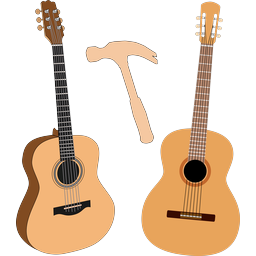
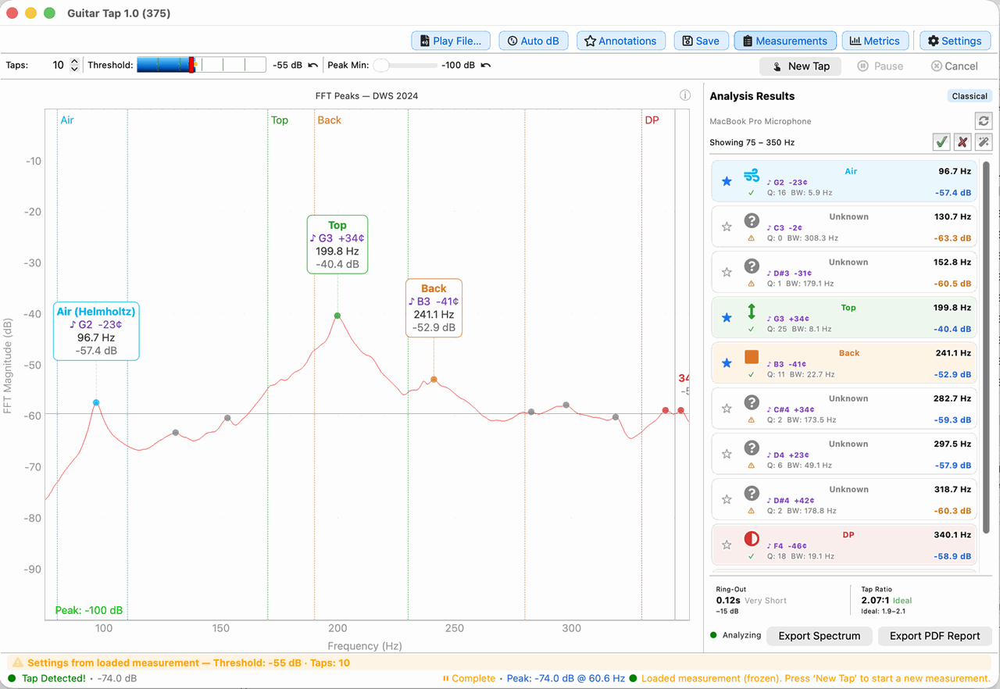

<p align="center">
  
</p>

<h1 align="center">Guitar Tap</h1>

<p align="center">
  <b>Tap-tone analysis for luthiers — capture a tap, run an FFT, and reveal a guitar's resonant modes and a tonewood's stiffness.</b>
</p>

<p align="center">
  <a href="https://github.com/dwsdolce/guitar_tap/releases">Download</a> ·
  <a href="https://www.dolcesfogato.com/guitar_tap/">Website</a> ·
  <a href="https://www.dolcesfogato.com/guitar_tap/manual/">User Manual</a>
</p>

---

Guitar Tap captures the brief ring-out after you tap a guitar, a tonewood plate, or a
brace, runs a high-resolution FFT, and reveals the resonant peaks and material properties
that matter to guitar builders. Use the results to guide your bracing, mass distribution,
and plate thickness.

It implements the tap-tone methodology from *Contemporary Acoustic Guitar Design and Build*
by Trevor Gore in collaboration with Gerard Gilet — built to improve reproducibility in
guitar building.

Guitar Tap is **free and open source**, written in Python 3 with PySide6, and runs on
Windows, macOS, and Linux. A polished native edition for iPhone, iPad, and Mac is also
coming to the App Store.

## Features

- **Guitar mode** — identify the key body resonances (Air/Helmholtz, Top, Back, and more),
  each labeled with frequency, pitch, and Q factor, plus the tap-tone ratio.
- **Plate mode** — measure a tonewood blank: Young's modulus along and across the grain,
  speed of sound, specific modulus, radiation ratio, a quality grade, and a Gore target
  thickness.
- **Brace mode** — a fast single-tap measurement of a brace strip's stiffness, speed of
  sound, specific modulus, and quality.
- Real-time spectrum that freezes automatically the instant a tap is detected.
- Multi-tap averaging and side-by-side comparison of saved measurements.
- Save measurements and export spectra, images, and PDF reports.
- Microphone calibration support for measurement mics.

<p align="center">
  
</p>

## Running from Installer

Prebuilt installers for macOS and Windows are on the
[releases page](https://github.com/dwsdolce/guitar_tap/releases).
Please note that the macOS installer only runs on systems newer than Big Sur (11.0), due
to the end of life of the earlier systems.

## Setting up on a new machine

All commands run in **bash**: Terminal on macOS, a shell on Linux, Cygwin bash (or Git Bash) on Windows. Every
repo has its own Python environment, `.venv`, made from its own requirements files; nothing uses another repo's
Python or the system's. The repo's scripts find `.venv` themselves (`.venv/bin`, or `.venv/Scripts` on Windows) and
stop if it is missing; `PYTHON=…` names another interpreter. On Windows, write `.venv/Scripts/` where these
commands say `.venv/bin/`.

### 1. Prerequisites
* Python 3.14 or later from https://www.python.org/, and git.
* System packages:
	- macOS: `brew install portaudio`
	- Linux (Debian/Ubuntu): `sudo apt update && sudo apt install portaudio19-dev libxcb-cursor-dev`
	- Windows: none.
* For the Quick Start Guide (testing and installers only): a native Pango library — macOS `brew install pango`,
  Linux `sudo apt install libpango-1.0-0 libpangoft2-1.0-0`, Windows the GTK runtime (see
  `packaging/generate_guide.py`). For the release-notes PDF (macOS installer): `brew install pandoc` and
  `brew install --cask basictex` (xelatex).

### 2. Clone and create the environment
```bash
git clone https://github.com/dwsdolce/guitar_tap
cd guitar_tap
python3.14 -m venv .venv
```

### 3. Install — one of three, by what you are doing
Each file includes `requirements.txt`, the application's own list; packages for one platform only (pyobjc on
macOS, comtypes on Windows) install there automatically.

| To | Install |
|---|---|
| Run from source | `.venv/bin/pip install -r requirements.txt` |
| Test and develop | `.venv/bin/pip install -r requirements-dev.txt` |
| Build installers | `.venv/bin/pip install -r requirements-packaging.txt` |

Then, for any of them: `.venv/bin/pip install -e . --no-deps` (the app's own package, from `src/`).

### 4. Run it
* `.venv/bin/python -m guitar_tap`
* **VS Code:** open the folder and select `.venv` as the Python interpreter.
* **Check a test setup works:** `Tooling/test-fast.sh`.

## Fast test run

`Tooling/test-fast.sh` runs the whole pytest suite except the two tests that replay every recording —
the playback regression (`tests/test_file_playback_regression.py`) and the self-regression
(`tests/test_self_regression.py`), which are most of the suite's time — for use while working.
Run the full suite (`pytest`) before a commit. The same split: web `npm run test:fast`, Swift
`Tooling/test-fast.sh`.

## Soak / stress testing

`Tooling/soak.sh` is an on-demand **dev tool** (not CI) that loops the fast pytest
suite many times to surface nondeterministic teardown/GC races (e.g. QObject
finalisation) that a single run hides:

```bash
./Tooling/soak.sh 200        # 200 runs; exits non-zero on any failure or hang
```

It runs under bash on macOS, Linux, and Windows (Cygwin / Git-Bash), with this repo's `.venv`
(`.venv/bin`, or `.venv/Scripts` on Windows).
A green soak is **confidence, not proof** — use a few hundred to ~1000 runs.

## Building installers

Set up for building installers (`requirements-packaging.txt`, see *Setting up on a new machine*).

Then run the platform script from the repository root:
	- Linux:   `./packaging/build_linux`
	- macOS:   `./packaging/build_mac`
	- Windows: `./packaging/build_win` (Cygwin bash)

### Platform-specific tooling

**Linux (AppImage):** the build script invokes `appimagetool`. Install it once:
	- `wget -O ~/bin/appimagetool https://github.com/AppImage/AppImageKit/releases/download/continuous/appimagetool-x86_64.AppImage`
	- `chmod +x ~/bin/appimagetool`
	- If `appimagetool` is elsewhere, set `APPIMAGETOOL=/path/to/appimagetool` before running `build_linux`.
	- On Ubuntu 22.04+ you may also need `sudo apt install libfuse2` for `appimagetool` to run.
	- For broadest compatibility, build inside a container running the oldest glibc you want to support (e.g. Ubuntu 22.04 LTS).

**Windows:** the installer step uses [Inno Setup 6](https://jrsoftware.org/isinfo.php) — install it in its default folder (`C:\Program Files (x86)\Inno Setup 6`), where `build_win` runs `ISCC.exe`. The Windows build is not code-signed.

**macOS:** code signing and notarization require an Apple Developer ID. The spec file ([packaging/guitar-tap.spec](packaging/guitar-tap.spec)) references the certificate identity — adjust it for your own developer account.

## Documentation

The full [User Manual](https://www.dolcesfogato.com/guitar_tap/manual/) covers every
measurement mode, the settings and controls reference, troubleshooting, and a glossary.

Design and cross-platform project docs (specs, parity map, roadmap) are maintained in the
project hub repo `guitar-tap-project`, not in this repo.

## Update check

On startup Guitar Tap checks this repository's public
[releases](https://github.com/dwsdolce/guitar_tap/releases) for a newer version and shows a
dismissible banner when one is available. The request reads GitHub's public release list and
sends no personal data, no audio, and no measurements. It runs at most once a day, and you can
turn it off in **Settings → About & Help → Check for updates at startup**. See the
[privacy policy](https://www.dolcesfogato.com/guitar_tap/privacy.html) for details.

## License

Copyright © 2026 Dolce Sfogato (David Smith).

Licensed under the GNU General Public License v3.0 — see [LICENSE](LICENSE).